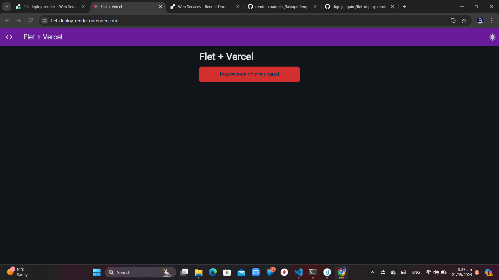

# Deploy Flet on Render

Use this repo as a template to deploy a Python [Flet](https://flet.dev) service on Render.

## Demo
[https://flet-deploy-render.onrender.com]


follow the steps below:

## Manual Steps

1. [create your own repository from this template - by Ghost04](https://github.com/diguijoaquim/flet-deploy-render/generate) if you'd like to customize the code.
2. Create a new Web Service on Render.
3. Specify the URL to your new repository or this repository.
4. Render will automatically detect that you are deploying a Python service and use `pip` to download the dependencies.
5. Specify the following as the Start Command.

    ```shell
    #its can take time to delect the port but will find
    python main.py
    ```

6. Click Create Web Service.


## Thanks

Thanks to [Harish](https://harishgarg.com) for the [inspiration to create a FastAPI quickstart for Render](https://twitter.com/harishkgarg/status/1435084018677010434) and for some sample code!